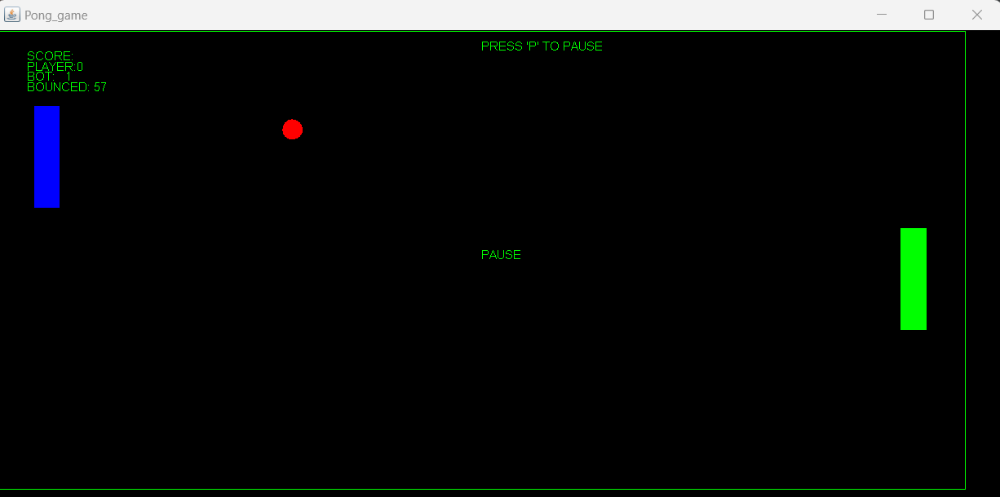
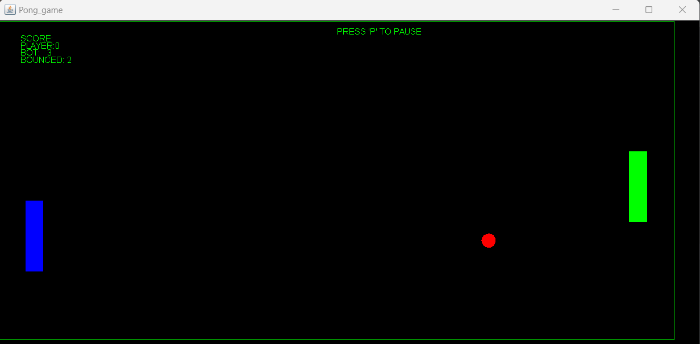
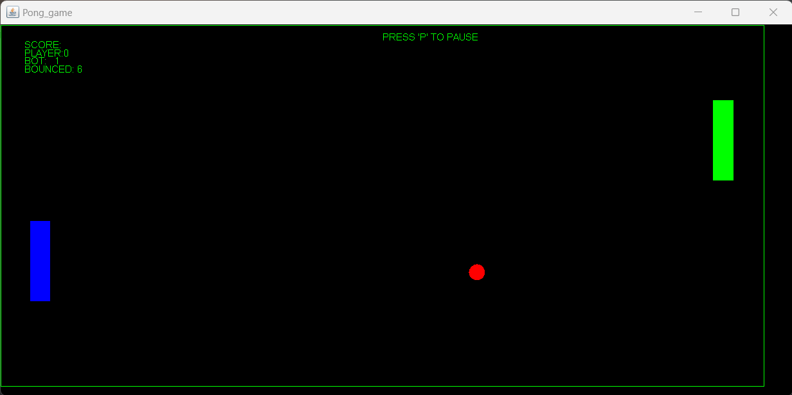
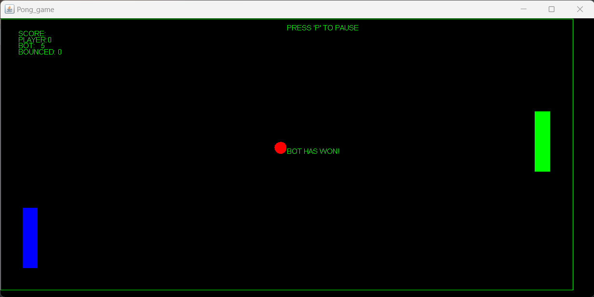

# Java Pong Game

This is a simple 2D Pong game implemented in Java using Swing for graphics and threads for game logic.

## Features

- Classic Pong gameplay
- Player vs Computer mode
- Simple and intuitive controls (arrow keys of WSAD)

## Requirements

- Java Development Kit
- Java Swing library

## Installation

1. Clone the repository:

git clone https://github.com/TomaszStr/JavaPong.git

2. Open project folder in IDE e.g. IntelliJ

3. Use Main() method to start game.

## Screenshots

